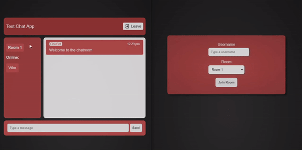

## :us: 
 # Simple Group Chat App with Socket.io

## Overview

This is a simple group chat application built using Socket.io, vanilla JavaScript, and Node.js. The main motivation behind creating this app was to practice working with websockets and real-time communication in web applications. The app allows users to join different chat groups and engage in real-time conversations with other users in the same group.

## Features

- **Real-time messaging:** Experience seamless and instant messaging within your chosen group.
- **Group Selection:** Choose a specific group to join and chat with other members in that group.
- **Usernames:** Create a unique username to identify yourself in the chat.
- **Easy Testing:** You can quickly test the app by following the instructions below.

To test the Group Chat App, follow these steps:

1. **Clone this repository to your local machine:**
2. Navigate to the server directory and start the server by running: 'cd server' and then  'node server.js'. By default it'll open on port 3000.
4. Open two different tabs or browser windows and access the app by visiting localhost:3000 (or the custom port you specified) in each tab.

You're now ready to use the Group Chat App! Create a unique username and select a group to start chatting. Messages sent in one tab will be instantly displayed in the other tab(s) within the same group.

## Contribution

Contributions are welcome! If you have any ideas for improvements, bug fixes, or additional features, feel free to submit a pull request.

## License

This project is licensed under the MIT License.
---

**Note:** This project is intended for educational and practice purposes. It may not include all the features of a production-ready application and might have limitations in terms of security and scalability. Use it as a learning resource and a starting point for your own projects involving real-time communication.

## :brazil:

# Aplicativo de Bate-Papo em Grupo Simples com Socket.io

## Visão Geral

Este é um aplicativo de bate-papo em grupo simples construído usando Socket.io, JavaScript puro (vanilla JavaScript) e Node.js. A principal motivação por trás da criação deste aplicativo foi praticar o trabalho com websockets e comunicação em tempo real em aplicações web. O aplicativo permite que os usuários participem de diferentes grupos de bate-papo e participem de conversas em tempo real com outros usuários no mesmo grupo.

## Recursos

- **Mensagens em tempo real:** Experimente mensagens instantâneas dentro do grupo escolhido.
- **Seleção de Grupo:** Escolha um grupo específico para participar e conversar com outros membros desse grupo.
- **Nomes de Usuário:** Crie um nome de usuário único para se identificar no bate-papo.
- **Teste Fácil:** Você pode testar rapidamente o aplicativo seguindo as instruções abaixo.

Para testar o Aplicativo de Bate-Papo em Grupo, siga estas etapas:

1. **Clone este repositório para a sua máquina local:**
2. Navegue até o diretório do servidor e inicie o servidor executando: 'cd server' e depois 'node server.js'. Por padrão, ele abrirá na porta 3000.
4. Abra duas abas ou janelas de navegador diferentes e acesse o aplicativo visitando localhost:3000 (ou a porta personalizada que você especificou) em cada aba.

Agora você está pronto para usar o Aplicativo de Bate-Papo em Grupo! Crie um nome de usuário exclusivo e selecione um grupo para começar a conversar. As mensagens enviadas em uma aba serão exibidas instantaneamente na outra aba dentro do mesmo grupo.

## Contribuições

Contribuições são bem-vindas! Se você tiver ideias para melhorias, correções de bugs ou recursos adicionais, sinta-se à vontade para enviar um pull request.

## Licença

Este projeto está licenciado sob a Licença MIT.
---

Nota: Este projeto destina-se a fins educacionais e de prática. Pode não incluir todos os recursos de um aplicativo pronto para produção e pode ter limitações em termos de segurança e escalabilidade. Use-o como um recurso de aprendizado e um ponto de partida para seus próprios projetos envolvendo comunicação em tempo real.
